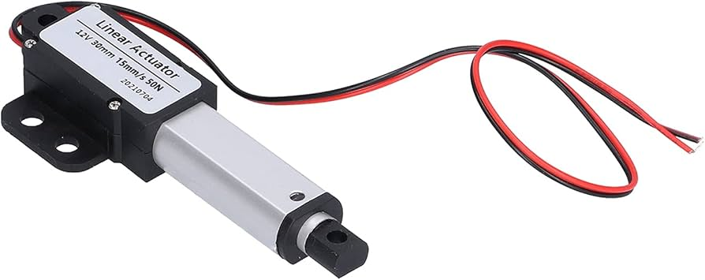
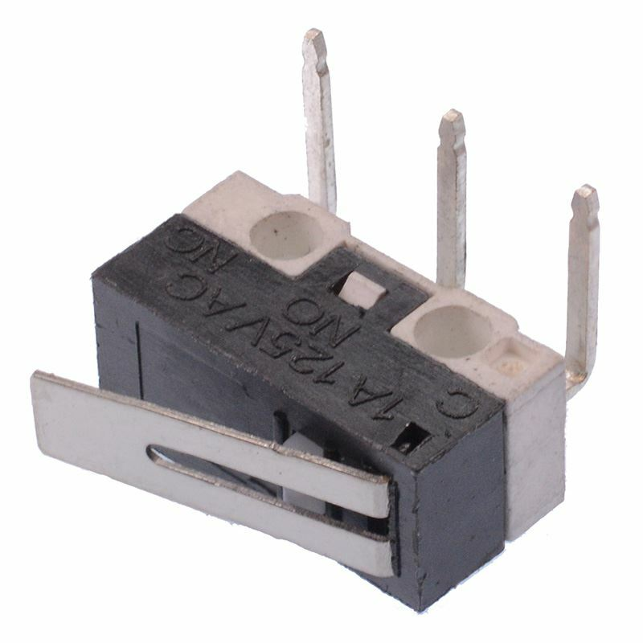

# Progettazione del Sistema di Controllo Drone

Questo repository contiene il firmware per un drone quadricottero custom, basato su Arduino Mega 2560, con un sistema di atterraggio innovativo a gambe estensibili. Lo sviluppo è stato guidato da un approccio modulare ("divide et impera") per isolare e risolvere le sfide ingegneristiche in modo strutturato.

## Architettura Hardware

La scelta dei componenti è stata un compromesso tra i requisiti di calcolo, percezione e attuazione.

* **Calcolo**: Una scheda **Arduino Mega 2560** gestisce l'intero sistema, eseguendo il loop di controllo a 50 Hz.
* **Percezione**: Una suite di sensori permette al drone di percepire sé stesso e l'ambiente:
    * **IMU GY-521 (MPU6050)** per la stima dell'assetto.
    * **VL53L0X (Time-of-Flight)** per la misura dell'altitudine.
    * **Microswitch** sulle gambe per il rilevamento del contatto al suolo.
    * **Ricevitore iBus** per i comandi del pilota.
* **Attuazione**: Due sistemi di attuatori traducono i comandi in azioni fisiche:
    * **Motori Brushless con ESC** per la propulsione in volo.
    * **Attuatori Lineari** per la movimentazione delle gambe.

| (a) Arduino Mega 2560 | (b) IMU GY-521 | (c) Sensore ToF VL53L0X |
| :---: | :---: | :---: |
|  |  |  |
| **(d) Motore Brushless con ESC** | **(e) Attuatore lineare** | **(f) Microswitch** |
|  |  |  |

## Architettura Software e Sfide Implementative

Il firmware è suddiviso in librerie C++ dedicate, orchestrate dal file `main.cpp`.

### Sfida 1: Stima Stabile dell'Assetto
Il rumore dei motori corrompeva le letture dell'accelerometro, mentre il giroscopio soffriva di deriva. Il problema è stato risolto fondendo i dati dei due sensori con un **filtro di Kalman**, la cui logica è implementata nella libreria `Orientation`. Il filtro usa il giroscopio per predire lo stato (angolo) e l'accelerometro per correggerlo.

* **Predizione**: $\hat{\phi}_k^- = \hat{\phi}_{k-1} + \Delta t \cdot \dot{\phi}_{gyro, k}$
* **Correzione**: $\hat{\phi}_k = \hat{\phi}_k^- + K_k (\phi_{acc, k} - \hat{\phi}_k^-)$

### Sfida 2: Stabilità dell'Alimentazione
I picchi di corrente assorbiti dai motori causavano reset hardware incontrollati. È stato implementato un **Watchdog Timer (WDT)**: se il loop principale si blocca per più di 30 ms, il WDT forza un riavvio controllato del microcontrollore, aumentando la sicurezza.

### Sfida 3: Modularità e Gestione delle Risorse
* **Astrazione degli Input**: La libreria `Receiver` astrae il protocollo iBus, normalizzando i segnali grezzi del radiocomando (1000-2000µs) in un range più intuitivo per il controllo (es. da -50 a +50).
* **Persistenza della Calibrazione**: Per evitare di ricalibrare l'IMU a ogni avvio, i valori di bias vengono salvati e letti dalla memoria **EEPROM**.
* **Gestione Asincrona**: La lettura del sensore di distanza, più lenta del loop di controllo, è gestita in modo asincrono per non bloccare l'esecuzione e garantire la reattività del sistema.

## Logiche di Controllo

### Controllo del Meccanismo di Atterraggio
Il sistema di atterraggio è controllato dalla libreria `LinMotor`. Quando il drone è vicino al suolo, la funzione `extendUntilContact` estende le gambe finché i microswitch non rilevano il contatto. Una volta a terra, si attiva il `groundControlLoop`, che utilizza due controllori PID per regolare l'estensione delle singole gambe e mantenere il corpo del drone livellato.

### Controllo di Volo
La stabilizzazione in volo è affidata a un'architettura **PID in cascata**:
1.  Un **loop esterno (angolo)** traduce l'input del pilota in una velocità angolare desiderata.
2.  Un **loop interno (rate)** agisce sui motori per raggiungere tale velocità.

La funzione `updateMotors` implementa la logica di **mixing**, che distribuisce la potenza ai quattro motori per generare le forze e i momenti necessari a controllare l'assetto. Per facilitare la messa a punto, i guadagni dei PID possono essere modificati "in volo" tramite il radiocomando. I controllori implementano anche una tecnica di **anti-windup** per prevenire l'accumulo eccessivo dell'errore integrale e migliorare la stabilità.

## Sviluppi Futuri
* Miglioramento della robustezza dell'alimentazione.
* Taratura dei PID basata su un modello matematico.
* Integrazione di sensori per la navigazione autonoma (GPS, Lidar).

## Bibliografia
* [Carbon Aeronautics - 12 | Program a PID controller to stabilize a drone](https://www.youtube.com/watch?v=jY6bBcMtseY&list=PLeuMA6tJBPKsAfRfFuGrEljpBow5hPVD4&index=15)
* [Pololu - VL53L0X Library for Arduino](https://github.com/pololu/vl53l0x-arduino)
* [bmellink - IBusBM Library for Arduino](https://github.com/bmellink/IBusBM)
